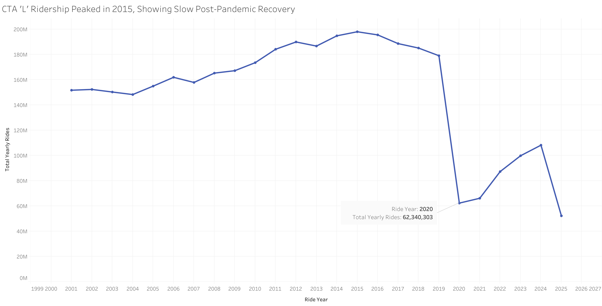
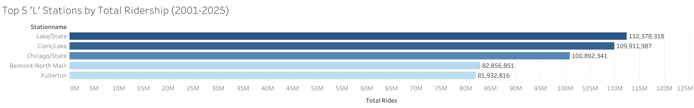
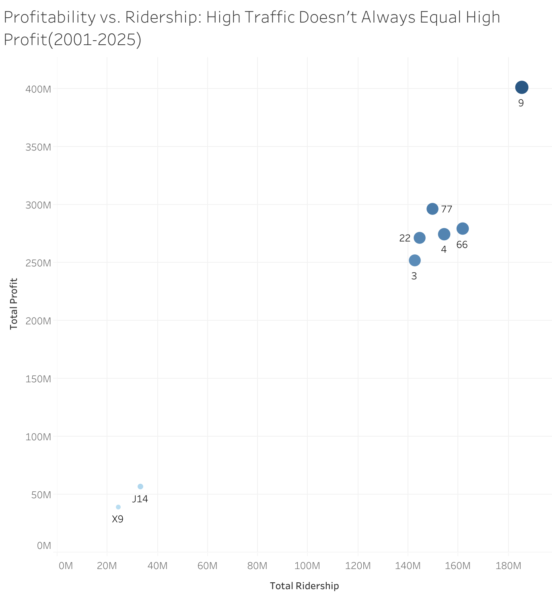

# Chicago Public Transit: Ridership and Efficiency Analysis

## Project Objective

In this project, I performed a comprehensive analysis of over two decades of ridership data from the Chicago Transit Authority (CTA). My objective was to handle a large-scale dataset, identify long-term trends, model operational efficiency, and generate actionable business insights. The entire workflow, from data ingestion in PostgreSQL to final visualization in Tableau, demonstrates a complete data analysis cycle.

---

## Tools & Technologies

* **Database:** PostgreSQL
* **Analysis:** SQL (Advanced Aggregations, Joins, CTEs)
* **IDE:** VS Code
* **Version Control:** Git & GitHub
* **Visualization:** Tableau Public

---

## The Analytical Process

### 1. Data Ingestion and Preparation
I began with two large datasets from the Chicago Data Portal, totaling over 1.5 million records. I used PostgreSQL's `\copy` command for efficient bulk loading of the raw CSV data into structured tables for both 'L' train and bus routes.

### 2. Data Engineering: Simulating Financial Data
To enable a deeper analysis of operational efficiency, I identified that the source data lacked financial metrics. To overcome this, I engineered a `route_financials` table, creating simulated cost and fare data for a representative sample of high-traffic bus routes. This shows a common and practical approach to enriching a dataset to answer more complex business questions when perfect data is not available.

### 3. Analysis with SQL
I wrote a series of SQL queries to move from broad exploration to specific insights:
* **Trend Analysis:** I aggregated daily data into yearly totals to understand the long-term health of the transit system.
* **Performance Metrics:** I identified the most critical infrastructure assets by calculating and ranking total ridership for all 'L' stations.
* **Efficiency Modeling:** I joined the ridership data with the engineered financial data to calculate key performance indicators (KPIs) like Total Revenue and Profit for the sample bus routes.

---

## Key Findings & Visualizations

### Finding 1: Ridership Peaked in 2015 and is in a Slow Recovery
My analysis of the 'L' system's yearly ridership reveals a clear narrative: a steady rise to a peak in 2015, followed by a decline that was severely impacted by the COVID-19 pandemic. The subsequent recovery is slow, a critical insight for future revenue forecasting and service planning.



### Finding 2: 'Clark/Lake' is the System's Most Critical Hub
By calculating total ridership across the entire 20+ year dataset, I identified 'Clark/Lake' as the undisputed busiest hub in the rail network. This data-driven finding pinpoints the most valuable location for infrastructure investment, maintenance resources, and advertising revenue.



### Finding 3: The Busiest Routes Are Not Always the Most Profitable
The most significant business insight comes from the financial efficiency analysis. By plotting ridership against profitability, it becomes clear that popularity does not guarantee financial success. In my model, **Route 9** delivered the highest profit in this sample, outperforming other routes with significantly higher ridership. This non-obvious finding suggests that a deeper review of operational costs on high-traffic routes could unlock significant efficiency gains.


```eof
